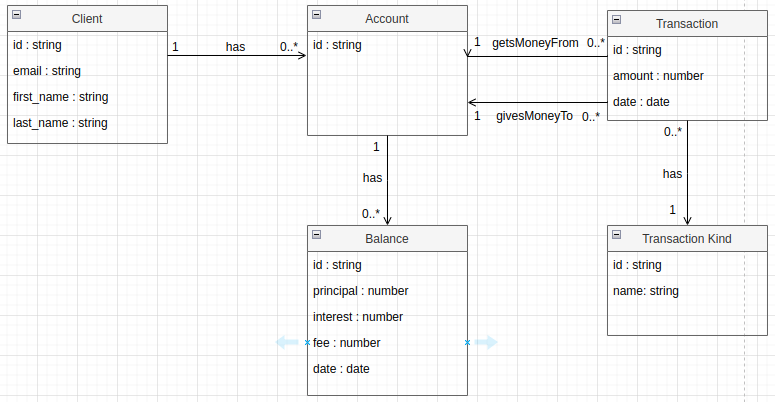

# Simple Banking Project


## Task 1

### Domain Model


### Relational model


### First Query
Select all clients with principal (in all of their accounts) higher than some number C at the end of the month.

```
SELECT a.client_id, cl.first_name, cl.last_name
FROM client cl
JOIN account a ON a.client_id = cl.id
JOIN balance b ON b.account_id = a.id
WHERE b.date <= ADD_MONTHS(LAST_DAY(b.date), -1)
GROUP BY a.client_id, cl.first_name, cl.last_name
HAVING SUM(b.principal) > C
ORDER BY cl.last_name, cl.first_name
```

I used date function from [Oracle](https://www.oracletutorial.com/oracle-date-functions/).

### Second Query
Select first 10 clients that have the highest accounts receivable at the end of the month.

```
SELECT a.client_id, c.first_name, c.last_name, SUM(b.principal + b.interest - b.fee) AS total_accounts_receivable
FROM client c
JOIN account a ON a.client_id = c.id
JOIN balance b ON b.account_id = a.id
WHERE b.date <= ADD_MONTHS(LAST_DAY(b.date), -1)
GROUP BY a.client_id, c.first_name, c.last_name
ORDER BY total_accounts_receivable DESC
FETCH FIRST 10 ROWS ONLY;
```

## Task 2

Run to compile the code:
```
npm run compile
```

Run to execute the code:
```
npm run start
```

Run to clean the compiled files:
```
npm run clean
```

